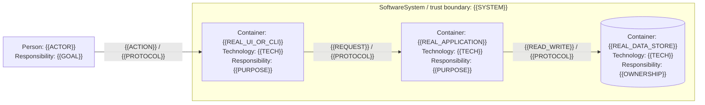
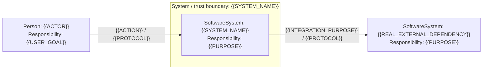
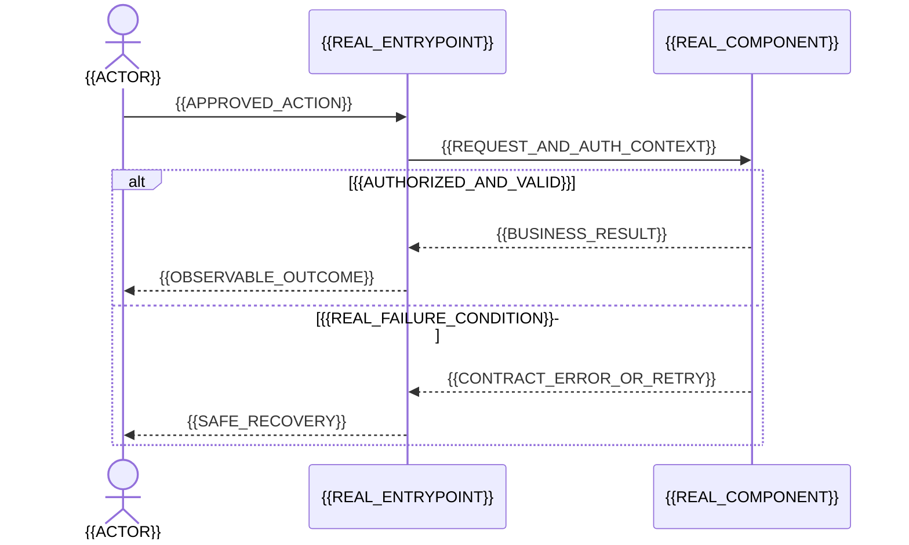

# Архитектура C4 + arc42 + ADR

## Цель
Создать architecture.md, c4-context.mmd, c4-containers.mmd, runtime.mmd и decisions.md после подтверждения PRD. В recover описывать наблюдаемую архитектуру, не переизобретать систему.
## Workflow
Проверь trusted PRD approval и hashes. Прочитай existing architecture/ADR/code. Сохрани current stack и конвенции, если требование не обосновывает изменение. Рассмотри минимум два разумных подхода для значимого решения (включая отсутствие нового сервиса/зависимости); объясни choice, trade-offs, reversibility, стоимость и риски. Для тривиального изменения допустима no-impact запись с доказательством.

arc42-adapted architecture.md: цели и quality drivers; constraints; context/scope; solution strategy; building blocks; runtime views; test-environment/deployment view только как контекст; cross-cutting concerns; decisions; measurable quality scenarios; risks/debt; glossary. Это документация устройства среды, не выполнение deployment.

C4 L1/L2 — Mermaid flowchart: каждый элемент имеет тип Person/SoftwareSystem/Container, имя, responsibility; контейнер содержит technology; связи имеют назначение и protocol. Явные system/trust boundaries, external dependencies, data stores. C4 Container не равно Docker container. L3 только для затронутого сложного компонента. Не называй произвольный flowchart C4 без этих семантических атрибутов. Не используй экспериментальный Mermaid C4 синтаксис; notation-independent C4 реализуется обычным flowchart.

Runtime sequence: основной пользовательский сценарий + значимый отказ/retry/idempotency; стрелки с сообщениями и межсервисными границами. Данные: сущности, ownership, transactional boundaries, migrations/compatibility. Security: trust boundaries, authn/authz, tenant isolation, validation, sensitive data; testability: управляемые часы, fixtures, доступные UI-семантики, observability результатов, без тестовых backdoors в production.

ADR запись: ID, status proposed/accepted/superseded, context, options, decision, consequences, linked BR/SYS (если ещё нет SYS — pending link), evidence. До gate только proposed. В recover не выдумывай исторические ADR: reconstructed decision + evidence + confidence.
## Exit
architecture-auditor проверяет PRD coverage, отсутствие gratuitous complexity, реалистичность NFR и тестируемость. При конфликте с BR возвращай upstream; при вопросе к архитектуре rework. Все .mmd синтаксически проверить доступным parser/renderer; отсутствие renderer явно помечается и требуется визуальная проверка человеком, не ложное «rendered».


## Полный файловый контракт

Этот раздел задаёт имена, scope, условие создания и точный шаблон каждого выхода. Краткие списки выше — обзор, не дополнительные outputs. Выбери только строки текущей ноды из `nodes`; не создавай файлы других стадий. Если `required: false`, всё равно действуют template и condition.

<!-- OUTPUT_CONTRACTS_BEGIN -->
```json
{
  "contract_version": "r4",
  "path_rules": {
    "run": "Путь относительно RUN output root текущей попытки, который дал runtime.",
    "project": "resolved_path относительно выбранного repository root. <run.id> — текущий run, остальные safe IDs из registry; glob в FLOW не задаёт имя каталога."
  },
  "outputs": [
    {
      "nodes": [
        "b04-defect-contract"
      ],
      "scope": "run",
      "path": "10-defect-contract/architecture.md",
      "resolved_path": "10-defect-contract/architecture.md",
      "required": true,
      "condition": "always",
      "template_id": "architecture",
      "writer": "main_agent"
    },
    {
      "nodes": [
        "b04-defect-contract"
      ],
      "scope": "run",
      "path": "10-defect-contract/decisions.md",
      "resolved_path": "10-defect-contract/decisions.md",
      "required": true,
      "condition": "always",
      "template_id": "decisions",
      "writer": "main_agent"
    },
    {
      "nodes": [
        "b04-defect-contract"
      ],
      "scope": "run",
      "path": "10-defect-contract/c4-context.mmd",
      "resolved_path": "10-defect-contract/c4-context.mmd",
      "required": true,
      "condition": "always",
      "template_id": "c4-context",
      "writer": "main_agent"
    },
    {
      "nodes": [
        "b04-defect-contract"
      ],
      "scope": "run",
      "path": "10-defect-contract/c4-containers.mmd",
      "resolved_path": "10-defect-contract/c4-containers.mmd",
      "required": true,
      "condition": "always",
      "template_id": "c4-containers",
      "writer": "main_agent"
    },
    {
      "nodes": [
        "b04-defect-contract"
      ],
      "scope": "run",
      "path": "10-defect-contract/runtime.mmd",
      "resolved_path": "10-defect-contract/runtime.mmd",
      "required": true,
      "condition": "always",
      "template_id": "runtime",
      "writer": "main_agent"
    },
    {
      "nodes": [
        "b04-defect-contract"
      ],
      "scope": "run",
      "path": "10-defect-contract/architecture-review.md",
      "resolved_path": "10-defect-contract/architecture-review.md",
      "required": true,
      "condition": "always",
      "template_id": "architecture-review",
      "writer": "main_agent"
    },
    {
      "nodes": [
        "b04-defect-contract"
      ],
      "scope": "project",
      "path": "docs/sdd/changes/*/10-defect-contract/architecture.md",
      "resolved_path": "docs/sdd/changes/<run.id>/10-defect-contract/architecture.md",
      "required": true,
      "condition": "always",
      "template_id": "architecture",
      "writer": "main_agent"
    },
    {
      "nodes": [
        "b04-defect-contract"
      ],
      "scope": "project",
      "path": "docs/sdd/changes/*/10-defect-contract/decisions.md",
      "resolved_path": "docs/sdd/changes/<run.id>/10-defect-contract/decisions.md",
      "required": true,
      "condition": "always",
      "template_id": "decisions",
      "writer": "main_agent"
    },
    {
      "nodes": [
        "b04-defect-contract"
      ],
      "scope": "project",
      "path": "docs/sdd/changes/*/10-defect-contract/c4-context.mmd",
      "resolved_path": "docs/sdd/changes/<run.id>/10-defect-contract/c4-context.mmd",
      "required": true,
      "condition": "always",
      "template_id": "c4-context",
      "writer": "main_agent"
    },
    {
      "nodes": [
        "b04-defect-contract"
      ],
      "scope": "project",
      "path": "docs/sdd/changes/*/10-defect-contract/c4-containers.mmd",
      "resolved_path": "docs/sdd/changes/<run.id>/10-defect-contract/c4-containers.mmd",
      "required": true,
      "condition": "always",
      "template_id": "c4-containers",
      "writer": "main_agent"
    },
    {
      "nodes": [
        "b04-defect-contract"
      ],
      "scope": "project",
      "path": "docs/sdd/changes/*/10-defect-contract/runtime.mmd",
      "resolved_path": "docs/sdd/changes/<run.id>/10-defect-contract/runtime.mmd",
      "required": true,
      "condition": "always",
      "template_id": "runtime",
      "writer": "main_agent"
    },
    {
      "nodes": [
        "b04-defect-contract"
      ],
      "scope": "project",
      "path": "docs/sdd/changes/*/10-defect-contract/architecture-review.md",
      "resolved_path": "docs/sdd/changes/<run.id>/10-defect-contract/architecture-review.md",
      "required": true,
      "condition": "always",
      "template_id": "architecture-review",
      "writer": "main_agent"
    },
    {
      "nodes": [
        "f05-architecture",
        "r05-architecture"
      ],
      "scope": "run",
      "path": "20-architecture/architecture.md",
      "resolved_path": "20-architecture/architecture.md",
      "required": true,
      "condition": "always",
      "template_id": "architecture",
      "writer": "main_agent"
    },
    {
      "nodes": [
        "f05-architecture",
        "r05-architecture"
      ],
      "scope": "run",
      "path": "20-architecture/c4-context.mmd",
      "resolved_path": "20-architecture/c4-context.mmd",
      "required": true,
      "condition": "always",
      "template_id": "c4-context",
      "writer": "main_agent"
    },
    {
      "nodes": [
        "f05-architecture",
        "r05-architecture"
      ],
      "scope": "run",
      "path": "20-architecture/c4-containers.mmd",
      "resolved_path": "20-architecture/c4-containers.mmd",
      "required": true,
      "condition": "always",
      "template_id": "c4-containers",
      "writer": "main_agent"
    },
    {
      "nodes": [
        "f05-architecture",
        "r05-architecture"
      ],
      "scope": "run",
      "path": "20-architecture/runtime.mmd",
      "resolved_path": "20-architecture/runtime.mmd",
      "required": true,
      "condition": "always",
      "template_id": "runtime",
      "writer": "main_agent"
    },
    {
      "nodes": [
        "f05-architecture",
        "r05-architecture"
      ],
      "scope": "run",
      "path": "20-architecture/decisions.md",
      "resolved_path": "20-architecture/decisions.md",
      "required": true,
      "condition": "always",
      "template_id": "decisions",
      "writer": "main_agent"
    },
    {
      "nodes": [
        "f05-architecture",
        "r05-architecture"
      ],
      "scope": "run",
      "path": "20-architecture/architecture-review.md",
      "resolved_path": "20-architecture/architecture-review.md",
      "required": true,
      "condition": "always",
      "template_id": "architecture-review",
      "writer": "main_agent"
    },
    {
      "nodes": [
        "f05-architecture",
        "r05-architecture"
      ],
      "scope": "project",
      "path": "docs/sdd/changes/*/20-architecture/architecture.md",
      "resolved_path": "docs/sdd/changes/<run.id>/20-architecture/architecture.md",
      "required": true,
      "condition": "always",
      "template_id": "architecture",
      "writer": "main_agent"
    },
    {
      "nodes": [
        "f05-architecture",
        "r05-architecture"
      ],
      "scope": "project",
      "path": "docs/sdd/changes/*/20-architecture/c4-context.mmd",
      "resolved_path": "docs/sdd/changes/<run.id>/20-architecture/c4-context.mmd",
      "required": true,
      "condition": "always",
      "template_id": "c4-context",
      "writer": "main_agent"
    },
    {
      "nodes": [
        "f05-architecture",
        "r05-architecture"
      ],
      "scope": "project",
      "path": "docs/sdd/changes/*/20-architecture/c4-containers.mmd",
      "resolved_path": "docs/sdd/changes/<run.id>/20-architecture/c4-containers.mmd",
      "required": true,
      "condition": "always",
      "template_id": "c4-containers",
      "writer": "main_agent"
    },
    {
      "nodes": [
        "f05-architecture",
        "r05-architecture"
      ],
      "scope": "project",
      "path": "docs/sdd/changes/*/20-architecture/runtime.mmd",
      "resolved_path": "docs/sdd/changes/<run.id>/20-architecture/runtime.mmd",
      "required": true,
      "condition": "always",
      "template_id": "runtime",
      "writer": "main_agent"
    },
    {
      "nodes": [
        "f05-architecture",
        "r05-architecture"
      ],
      "scope": "project",
      "path": "docs/sdd/changes/*/20-architecture/decisions.md",
      "resolved_path": "docs/sdd/changes/<run.id>/20-architecture/decisions.md",
      "required": true,
      "condition": "always",
      "template_id": "decisions",
      "writer": "main_agent"
    },
    {
      "nodes": [
        "f05-architecture",
        "r05-architecture"
      ],
      "scope": "project",
      "path": "docs/sdd/changes/*/20-architecture/architecture-review.md",
      "resolved_path": "docs/sdd/changes/<run.id>/20-architecture/architecture-review.md",
      "required": true,
      "condition": "always",
      "template_id": "architecture-review",
      "writer": "main_agent"
    }
  ],
  "mutation_contracts": []
}
```
<!-- OUTPUT_CONTRACTS_END -->

### Шаблон `architecture` — Архитектура решения

```markdown
# Архитектура решения

Revision: {{REVISION}} | run_id: {{RUN_ID}} | flow: {{FLOW}} | step_id: {{NODE_ID}} | attempt: {{ATTEMPT}} | stage: {{STAGE}}
Status: {{ready / needs_input / needs_rework / blocked}}
Sources: {{точные file:line / Q-ID / runtime references с ревизиями}}

## 1. Цели и quality drivers
{{Принятые BR/AC, ключевые NFR и бизнес-драйверы.}}
## 2. Ограничения и as-is
{{Stack, интеграции, существующие ADR; no-impact с доказательством.}}
## 3. Контекст и границы C4 L1
{{Ссылка на c4-context.mmd; Person/SoftwareSystem, ответственность, внешние системы, trust boundaries.}}
## 4. Стратегия и альтернативы
{{Разумные варианты; в том числе без нового сервиса; выбор, trade-offs, reversibility.}}
## 5. Building blocks C4 L2
{{Ссылка c4-containers.mmd; Container ≠ Docker; technology, responsibility, protocols, data ownership.}}
## 6. Runtime views
{{runtime.mmd; основной сценарий, ошибки/retry/idempotency, consistency.}}
## 7. Среда исполнения и тестирования
{{Контекст окружения и зависимостей, не deploy; readiness, fixtures, observability.}}
## 8. Сквозные решения
{{Authn/authz, tenant boundaries, данные, миграции, время/валюты/локали, error model.}}
## 9. ADR
{{decisions.md; proposed до gate, в recover reconstructed, supersedes вместо переписывания старого.}}
## 10. Измеримые quality scenarios
{{Stimulus, environment, response, threshold, verification; неизвестное не выдумывать.}}
## 11. Риски и технический долг
{{Impact, owner, mitigation и acknowledged gaps.}}
## 12. Трассировка и глоссарий
{{BR/AC → block/ADR → будущие SYS; pending links до SRS явно.}}
## Проверка диаграмм
{{Команда и результат реального parser/renderer; отсутствие renderer означает непроверенный render.}}
```

### Шаблон `architecture-review` — Ревью архитектуры

```markdown
# Ревью архитектуры

Revision: {{REVISION}} | run_id: {{RUN_ID}} | flow: {{FLOW}} | step_id: {{NODE_ID}} | attempt: {{ATTEMPT}} | stage: {{STAGE}}
Status: {{ready / needs_input / needs_rework / blocked}}
Sources: {{точные file:line / Q-ID / runtime references с ревизиями}}

## Объект и границы проверки
{{Профиль ревью, входные files/hashes, принятые требования, out-of-scope.}}
## Независимые задания и ожидание
| Сабагент | Task ID | Проверенные входы | Завершение | Verdict | Ссылка на полный ответ |
|---|---|---|---|---|---|
| {{name}} | {{actual id}} | {{hashes}} | {{completed/failed/timed_out}} | {{PASS/REWORK/BLOCKED/N/A}} | {{section}} |
## Проверки
| Check ID | Условие | Результат | Evidence |
|---|---|---|---|
| {{id}} | {{check}} | {{pass/fail/blocked/not_run/N/A}} | {{file:line / hash}} |
## Findings
| ID | Severity | File:line | BR/SYS/AC/TC | Факт | Последствие | Исправление | Owner | Disposition |
|---|---|---|---|---|---|---|---|---|
| {{id}} | {{critical/major/minor/info}} | {{source}} | {{IDs}} | {{fact}} | {{impact}} | {{fix}} | {{owner}} | {{open/fixed/nonblocking}} |
## Непроверенное и блокеры
{{Что невозможно подтвердить; никакого PASS по отсутствующему ответу.}}
## Полные ответы сабагентов
{{Ответ каждого по шаблону subagent-result; не заменять вымышленным резюме.}}
## Вердикт и маршрут
{{ready / needs_rework / upstream_change / blocked; причина и target. Это не human approve.}}
```

### Шаблон `c4-containers` — C4 L2

Каркас не навязывает три контейнера: оставить только наблюдаемые/обоснованные. Для no-impact сохранить реальные L1/L2 и отметить отсутствие изменения.



### Шаблон `c4-context` — C4 L1

Удалить неприменимую внешнюю систему, а не изобретать её. Все имена, роли, связи и протоколы подкрепить evidence. Это C4-семантика на обычном Mermaid flowchart.



### Шаблон `decisions` — Архитектурные решения

```markdown
# Архитектурные решения

Revision: {{REVISION}} | run_id: {{RUN_ID}} | flow: {{FLOW}} | step_id: {{NODE_ID}} | attempt: {{ATTEMPT}} | stage: {{STAGE}}
Status: {{ready / needs_input / needs_rework / blocked}}
Sources: {{точные file:line / Q-ID / runtime references с ревизиями}}

## Реестр решений
| ADR-ID | Статус | Краткое решение | Связанные BR/SYS | Supersedes |
|---|---|---|---|---|
| {{ADR-ID}} | {{proposed/reconstructed/accepted/superseded}} | {{decision}} | {{IDs/pending}} | {{old ADR/N/A}} |
## {{ADR-ID}} — {{название}}
### Контекст и доказательства
{{Problem, constraints, evidence; в recover явно reconstructed и confidence.}}
### Альтернативы
{{Options, плюсы/минусы, no-new-component вариант либо обоснование тривиальности.}}
### Решение
{{Chosen option, rationale; до gate proposed.}}
### Последствия и проверка
{{Positive/negative consequences, compatibility, reversal, testability.}}
### Связи
{{BR/AC/SYS, diagrams, source refs, predecessor ADR.}}
## Нерешённые вопросы
{{Owner, impact, blocking.}}
```

### Шаблон `runtime` — Последовательность runtime

Дополнить реальными участниками/данными/idempotency только по scope. Не выдавать syntactic source за rendered image.



## Основания и границы адаптации
- [S11] C4 model: diagrams: https://c4model.com/diagrams
- [S12] arc42: template overview: https://arc42.org/overview/
- [S13] Mermaid: flowchart: https://mermaid.js.org/syntax/flowchart.html
- [S22] OWASP ASVS: https://owasp.org/www-project-application-security-verification-standard/

Инструкции набора — оригинальная адаптация; внешние frameworks не устанавливаются и не запускаются неявно.
